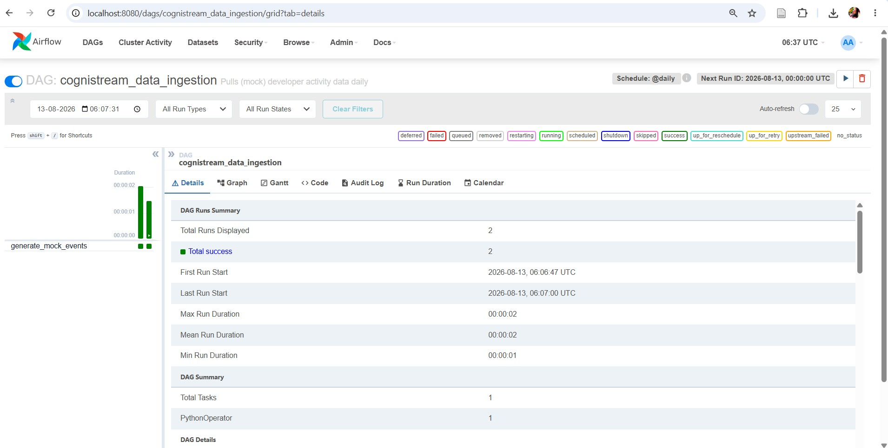

# CogniStream — Developer Flow-State & Cognitive Load Analytics

### My Contributions  — Ingestion & Orchestration Track

My contribution focuses on **mock data generation and Airflow-based orchestration**.

## Responsibilities

- Generate mock **GitHub, Slack, Jira & VSCode** activity data using Python
- Generate data for a **5-day work week**
- Set up **Apache Airflow**
- Create DAGs for scheduled data generation
- Verify successful manual and scheduled DAG runs

## Tech Stack

- Python
- Apache Airflow
- PostgreSQL
- Docker Compose
- JSON

## Project Structure

```text
CogniStream/
│
├── dags/
│   └── mock_data_pipeline.py
│
├── data_ingestion/
│   └── generate_mock_data.py
│
├── docs/
│   └── screenshots/
│       └── airflow_success.jpg
│
├── docker-compose.yaml
├── requirements.txt
└── README.md

```


## Mid-Review Deliverable

Orchestration Audit -- Airflow DAG runs successfully, confirmed via the
Airflow UI (Grid view shows successful runs for `generate_mock_events`).
