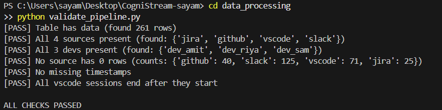
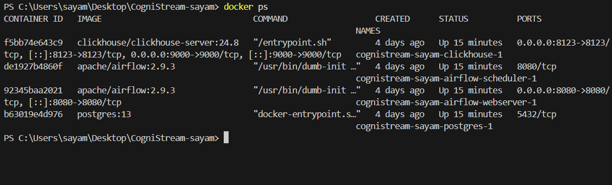
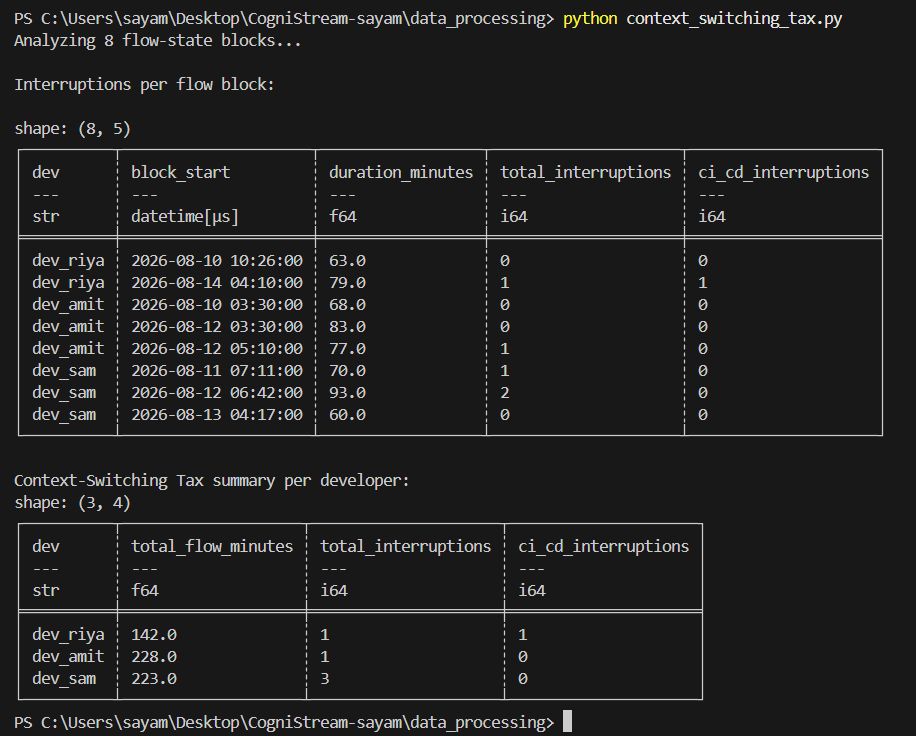
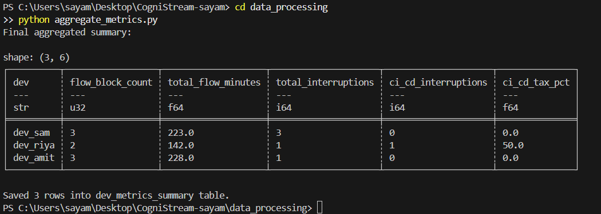
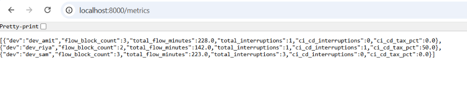

# CogniStream — Developer Flow-State & Cognitive Load Analytics

CogniStream analyzes developer activity across GitHub, Slack, Jira, and VSCode to measure developer flow-state, cognitive load, and the "Context-Switching Tax" instead of relying on shallow metrics like lines of code or tickets closed.

## Problem Statement

Traditional engineering productivity metrics focus on output but ignore interruptions and friction during development. Frequent notifications, CI/CD alerts, and task switching can reduce deep, focused work.

CogniStream identifies these patterns and provides data-driven insights to help Engineering Managers understand and improve developer productivity and experience.

## Use Case

Instead of simply seeing how many commits Team A made, an Engineering Manager can identify that frequent CI/CD Slack alerts are interrupting IDE sessions and causing significant context switching. This helps managers improve notification policies, reduce unnecessary interruptions, and protect developers' deep-work time.

## My Contributions

- Generated mock GitHub, Slack, Jira, and VSCode activity data for a 5-day work week.
- Built and deployed the Apache Airflow data pipeline.
- Set up ClickHouse for event storage.
- Developed Polars-based ETL for loading event data.
- Implemented automated data-quality validation checks.
- Implemented automated data-quality validation checks.
- Built the flow-state detection algorithm using Polars.
- Developed the Context-Switching Tax metric to quantify interruption impact.
- Aggregated per-developer metrics into a ClickHouse summary table for the API layer.
- Built a FastAPI backend to serve developer metrics as JSON endpoints.


## Tech Stack

Python (Polars) · Apache Airflow · ClickHouse · Docker · FastAPI (planned) · React + Tremor.js (planned)

## Architecture

Mock APIs → Apache Airflow → ClickHouse → Polars Flow-State Logic → FastAPI → React Dashboard

## Project Structure

```text
CogniStream/
├── dags/
│   └── mock_data_pipeline.py
├── data_ingestion/
│   └── generate_mock_data.py
├── data_processing/
│   ├── load_to_clickhouse.py
│   ├── validate_pipeline.py
│   ├── flow_state_detection.py
│   ├── context_switching_tax.py
│   └── aggregate_metrics.py
├── api/
│   └── main.py
├── docs/
│   └── screenshots/
├── docker-compose.yaml
└── requirements.txt
```

## Progress

- Day 1–2: Mock data generators for GitHub, Slack, Jira, and VSCode.
- Day 3–4: Airflow DAG developed and verified through Docker.
- Day 5–6: ClickHouse deployed and 261 events loaded through Polars ETL.
- Day 7–8: Automated pipeline validation implemented with 6 passing data-quality checks.
- Day 9–11: Built the flow-state detection algorithm, Context-Switching Tax metric, and aggregated per-developer summary table — core analytics logic complete.
- Day 12: Built the FastAPI backend serving developer metrics as JSON, with auto-generated interactive docs.
## Proof of Work

Airflow DAG running successfully:


Pipeline validation:



Full stack running:



Context-Switching Tax — flow-state analysis output:


Aggregated flow-state & context-switching metrics per developer:


FastAPI serving live developer metrics as JSON:

## Next Steps

- React + Tremor.js analytics dashboard
- Connect frontend to FastAPI endpoints

## Author

**Sayam Stuti Shuvadarsini**

LinkedIn: https://www.linkedin.com/in/sayam-stuti-shuvadarsini  
GitHub: https://github.com/sayamstuti  
Email: sayamstuti594@gmail.com